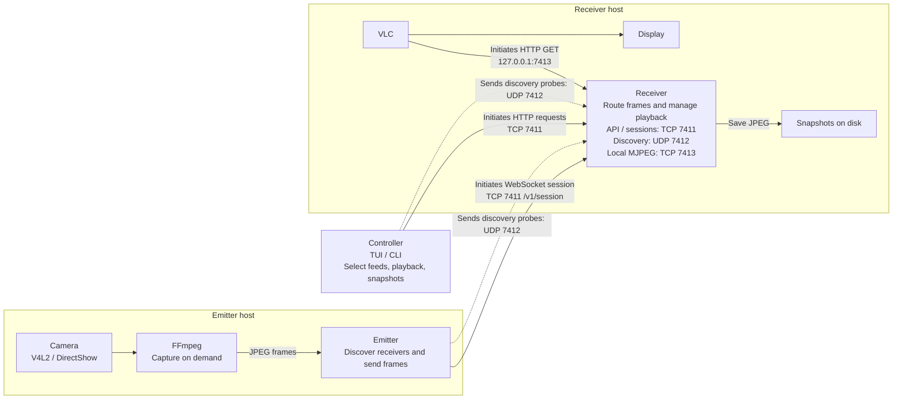

# patvs

Portable All Terrain Video Streaming routes Linux and Windows camera feeds between
unattended machines on an installation network. One executable runs as an
emitter and receiver together by default, or as an explicit emitter, receiver,
or controller.

## Architecture



Network arrows point from the **connection initiator to the listener**; replies
and video can flow back over the same connection. Dashed arrows are UDP discovery
probes, which receive replies without opening a connection. Other arrows show
local capture, display, and storage. Ports shown are defaults.

| Initiator | Listener | Default port | Protocol and purpose |
| --- | --- | --- | --- |
| Controller | Receiver | TCP 7411 | HTTP API: select feeds, start/stop streams or VLC, request snapshots, read status. |
| Emitter | Receiver | TCP 7411 | WebSocket `/v1/session`: emitter sends JPEG frames, registration, and heartbeats; receiver sends stream demand, snapshot requests, and receiver hints. |
| Emitter / controller / other receivers | Receiver | UDP 7412 | Discovery probes via IPv4 broadcast or IPv6 multicast; receiver replies with its identity and API port. |
| Emitter / controller / other receivers | Receiver | TCP 7411 | HTTP `/v1/health` probes for seeds and discovery fallbacks; controller also scans private networks. |
| VLC / local stream client | Receiver on the same host | TCP 7413, loopback only | HTTP GET `/streams/<emitter-id>.mjpg`; receiver returns an MJPEG feed. |

The receiver is the hub: the controller reaches emitters through it, and it starts
and stops local VLC and saves snapshots on its own disk. Emitters open sessions
to multiple receivers and run FFmpeg only while frames are requested. Multiple
emitters can connect to each receiver; VLC displays one selected feed at a time.
The HTTP API and WebSocket sessions authenticate with the shared installation
secret; discovery and `/v1/health` do not require it. See the
[protocol documentation](docs/PROTOCOL.md) for wire details.

## Runtime requirements

- Linux on x86-64, ARM64, or ARMv7; Windows 10/11 on x86-64 or ARM64
- FFmpeg on emitters, plus `v4l2-ctl` on Linux emitters
- VLC on receivers that drive a screen

The daemons discover receivers automatically on connected LANs. The controller
also probes RFC1918 private addresses, so it can find routed private LANs even
when local broadcast does not reach them. It checks common `/24` networks
first, then samples and eventually covers the remaining private addresses in
parallel at a capped 512 probes per second. The TUI shows scan progress;
scanning all private addresses can take hours. Seeds remain useful for faster
discovery on unusual subnets. Internet relays and NAT traversal are planned
after the local network implementation.

## Build

```sh
go test ./...
./scripts/build.sh
```

The Linux build cross-compiles static Linux binaries and Windows `.exe` files
and writes checksums under `dist/`. Optional build metadata can be supplied
without editing source:

```sh
VERSION=0.1.0 SEEDS=receiver.example.net:7411 ./scripts/build.sh
```

GitHub Actions runs tests and publishes these binaries and `SHA256SUMS` as a
release on pushes to any branch that change Go files, `go.mod`, `go.sum`, the
build scripts, FFmpeg notices, or the release workflow. The Linux release job
also extracts Windows FFmpeg executables from pinned, checksum-verified archives; see
[FFmpeg downloads and source references](docs/FFMPEG.md). Native Linux and
Windows tests must pass before publishing. Releases use unique
`build-<run number>-<attempt>` tags pointing to the pushed commit.
Each published release is marked as latest, so the download URL stays stable:

```sh
wget -O patvs https://github.com/mortrevere/patvs/releases/latest/download/patvs-linux-amd64
chmod +x patvs
```

For ARM64 or ARMv7, replace `patvs-linux-amd64` with `patvs-linux-arm64` or
`patvs-linux-armv7`. Checksums are available at
`https://github.com/mortrevere/patvs/releases/latest/download/SHA256SUMS`.

Run the freshly built x64 controller from this checkout with
`./dist/patvs-linux-amd64 controller`. The build does not replace a separate
`patvs` command already on your `PATH`.

## Windows

Download `patvs-windows-amd64.exe` from the same release (or
`patvs-windows-arm64.exe` for Windows on ARM):

```powershell
Invoke-WebRequest https://github.com/mortrevere/patvs/releases/latest/download/patvs-windows-amd64.exe -OutFile patvs.exe
./patvs.exe             # receiver and emitter together
./patvs.exe controller  # controller in another terminal
./patvs.exe receiver    # receiver only
./patvs.exe emitter     # emitter only
```

The default launch runs both roles in one process. Run the controller in its
own terminal. PowerShell, Command Prompt, and Windows Terminal are supported.
Controllers only need patvs. Emitters need a
Windows FFmpeg build with [DirectShow support](https://ffmpeg.org/ffmpeg-devices.html#dshow);
download `ffmpeg.exe` from the same release (or `ffmpeg-arm64.exe` for Windows
on ARM and rename it to `ffmpeg.exe`). Put it on `PATH` or beside `patvs.exe`,
and keep `FFMPEG-LICENSE.txt` with it. Receivers find VLC
on `PATH`, beside patvs, or in its standard `Program Files/VideoLAN/VLC` installation.
Use `--player 'C:\custom path\vlc.exe'` to override this.

Automatic camera selection prefers a usable mode of at least 640x480, then
native MJPEG. Specify a camera by its DirectShow name when needed:

```powershell
ffmpeg -hide_banner -list_devices true -f dshow -i dummy
./patvs.exe emitter --camera 'Integrated Camera'
./patvs.exe emitter --camera 'lavfi:color=c=red:s=640x480:r=25'
```

The FFmpeg listing command normally exits with an error after printing the
device list. Enable camera access for desktop applications in Windows privacy
settings. A USB camera attached to WSL is unavailable to native Windows until
detached from WSL. Linux continues to use V4L2.

Allow patvs on your private network when Windows Firewall prompts. Receivers
need inbound TCP 7411 and UDP 7412; emitters and controllers also need UDP
discovery replies. TCP 7413 stays on loopback. If broadcast is blocked, pass
`--seeds 10.0.0.29:7411,10.0.0.30:7411` for known receivers.
Windows and Linux machines use the same commands, shared secret, and protocol.

State and snapshots default to `%LOCALAPPDATA%\patvs`; `--state` and
`--snapshot-dir` override these paths. Ctrl+C shuts down the running roles and
their managed media processes. A fatal error in either role stops both in
combined mode. For unattended desktop playback, create a Task Scheduler task
at user logon, select **Run only when user is logged on**, set the program to
the full path of `patvs.exe`, and leave the arguments empty to run both roles,
or give it `receiver` or `emitter` arguments for a single role. Configure restart on failure. Use
`PATVS_SECRET` or `--secret` to match the Linux installation. Receiver VLC
playback needs an interactive Windows desktop session.

To repeat the portable end-to-end test with Go and FFmpeg installed:

```powershell
$env:PATVS_INTEGRATION = '1'
$env:PATVS_TEST_PLAYER = 'vlc' # optional: also exercise real fullscreen playback
go test ./internal/patvs -run TestLocalVideoIntegration -v
```

Set `$env:PATVS_TEST_CAMERA = 'auto'` to test a real webcam instead of the synthetic
source. The test uses temporary state and ports and stops its own processes.

## Run

```sh
patvs --secret installation-secret  # receiver and emitter together
patvs receiver --secret installation-secret
patvs emitter --secret installation-secret
patvs controller --secret installation-secret
```

`--secret` defaults to `patvs` for immediate setup on a trusted LAN. Use a
custom shared value for an installation. Running `patvs` with no arguments
starts both roles, including when launching the Windows executable directly.
Options without a mode apply to both roles; for example,
`patvs --camera auto --display-aspect-ratio 4:3`. Run `patvs --help` or any
explicit mode with `-h` for options.

Emitter and receiver logs go to stderr with timestamps, severity, mode, and
process ID (`mode=both` for the default combined process). Each role prints
its absolute state file path on a dedicated INFO startup line, even without
`--debug`: `msg="state file" role=emitter path=/absolute/path/emitter.json`.
Logs also include discovery, connections, stream requests, snapshots, capture/player lifecycle,
and failures. Add `--debug` for connection attempts,
discovery counts, commands, first-frame delivery, and FFmpeg/VLC arguments:

```sh
patvs emitter --debug
patvs receiver --debug
journalctl -u patvs-emitter -u patvs-receiver -f
```

For installed services, add `--debug` to the unit's `ExecStart` using
`systemctl edit`, then reload systemd and restart the service. Logs never
include the shared secret or authorization header.

The controller starts its interactive terminal interface when no command is
given. The receiver list shows each receiver's current feed and source, or
`idle` when nothing is playing. Use ↑/↓ to select a receiver, Enter to open it,
and ↑/↓ to select an emitter. Enter starts its feed and fullscreen VLC
playback; `n` saves a snapshot, `x` stops VLC and its feed, and `d` deletes the
selected offline emitter from that receiver's saved state, including its
stream/playback settings. Online emitters cannot be deleted; a forgotten emitter
can register again if it reconnects. Esc goes back, and
`k` stops background discovery. `r` refreshes once; `q` quits. The scan status
stays visible at the bottom. The selected receiver screen also lists current
FFmpeg and VLC processes on that host, with PIDs and command lines.
Scriptable commands are:

```text
patvs controller receivers
patvs controller status <receiver>
patvs controller emitters <receiver>
patvs controller snapshot <receiver> <emitter>
patvs controller stream <receiver> <emitter> start|stop
patvs controller play <receiver> <emitter>
patvs controller stop <receiver>
patvs controller delete <receiver> <emitter>
```

The `stream` command is for clients that consume the receiver's loopback
MJPEG socket directly. VLC playback starts its own feed and stopping it
releases that feed.

Names, full IDs, unambiguous ID prefixes, and receiver addresses are accepted.
Add `--json` before the command for machine-readable output. For repeatable
video tests, an emitter can use an FFmpeg source such as
`--camera 'lavfi:color=c=red:s=640x480:r=25'`.

## Unattended installation

Install the binary as `/usr/local/bin/patvs`, create a locked `patvs` system
user, copy the required units from `deploy/` to `/etc/systemd/system/`, and copy
`deploy/patvs.env.example` to `/etc/patvs/patvs.env`. Set the same
`PATVS_SECRET` on every member of the installation, then enable either or both
services:

```sh
systemctl enable --now patvs-emitter.service patvs-receiver.service
```

The service account needs the `video` group for cameras and the receiver also
needs `render` for direct DRM/KMS output. For desktop playback, arrange for the
graphical login session to write its `DISPLAY`, `WAYLAND_DISPLAY`,
`XDG_RUNTIME_DIR`, and `DBUS_SESSION_BUS_ADDRESS` values to
`/run/patvs/display.env`, then restart `patvs-receiver`. Without those values,
patvs asks VLC to use DRM/KMS when `/dev/dri/card0` exists and framebuffer
output when `/dev/fb0` exists.
Receiver playback ignores saved VLC preferences and explicitly requests a
standalone fullscreen video window with automatic scaling to fit the screen.
The receiver's `--debug` flag also enables VLC's own verbose diagnostics.

To stretch incoming video to fill the display without letterboxing or
pillarboxing, set the receiver's **display** ratio, regardless of the source:

```sh
patvs receiver --display-aspect-ratio 4:3  # 4:3 screen, including 16:9 feeds
patvs receiver --display-aspect-ratio 16:9 # widescreen, including 4:3 feeds
```

For services, set `PATVS_DISPLAY_ASPECT_RATIO=4:3` or `16:9` in
`/etc/patvs/patvs.env`. This stretches the whole picture without cropping and
applies to desktop, DRM/KMS, and framebuffer playback. VLC 3 requires a fixed
target ratio; resizing a desktop window to another ratio may still leave
borders. Without this setting, playback preserves the source aspect ratio.

For testing under Hyprland 0.52, placement rules can override VLC's fullscreen
request. Add these rules after general placement rules in your Hyprland config
to target the receiver's `patvs-playback` window:

```ini
windowrule = fullscreen, initialTitle:^(patvs-playback)$
windowrule = fullscreenstate 2 2, initialTitle:^(patvs-playback)$
```

Reload Hyprland with `hyprctl reload`, then stop and start receiver playback
so the rule applies to a new window. Check `hyprctl clients` for the
`patvs-playback` title and fullscreen state.

On Raspberry Pi OS, HDMI works through the normal KMS setup. Composite output
must be provisioned before installation by enabling the composite KMS overlay
and selecting the required PAL/NTSC mode in the Raspberry Pi boot
configuration; composite and HDMI behavior depends on the Pi model and OS
release.

Run the synthetic end-to-end check on a Linux development machine with FFmpeg:

```sh
./scripts/integration-test.sh
```

On Linux hosts that permit unprivileged network namespaces, the network test
disables UDP discovery by using mismatched ports, verifies bounded `/24`
fallback, changes the receiver address, and checks reconnection:

```sh
./scripts/network-test.sh
```

The default ports are TCP 7411 for the receiver API and emitter sessions, UDP
7412 for discovery, and loopback TCP 7413 for received MJPEG streams. State is
stored below `$XDG_STATE_HOME/patvs` or `~/.local/state/patvs` on Linux and
`%LOCALAPPDATA%\patvs` on Windows; emitter and
receiver modes use separate files and identities. The default combined launch
reuses those same files. In combined mode, `--state /path/node.json` selects
`/path/node-receiver.json` and `/path/node-emitter.json`; a prefix without an
extension gets `.json`. Explicit single-role commands still use the exact
`--state` path provided. `--reset` without a mode resets both roles while
keeping their identities.

Emitters forget remembered receivers after 10 consecutive failed connection
attempts. Successful connections reset the count; discovery can find forgotten
receivers again.

Run `patvs emitter --reset` to forget remembered receivers on startup while
keeping the emitter's device ID. Explicit seeds still apply, and discovery
can find and remember receivers again.
Run `patvs receiver --reset` to forget remembered emitters and clear their
stream/playback settings while keeping the receiver's device ID and saved
snapshots. The controller stores discovery results only in memory; restarting
it already clears them.

See [DEVPLAN.md](DEVPLAN.md) for milestones, acceptance criteria, and current
implementation status. [docs/PROTOCOL.md](docs/PROTOCOL.md) records the local
wire behavior and the planned relay boundary.
